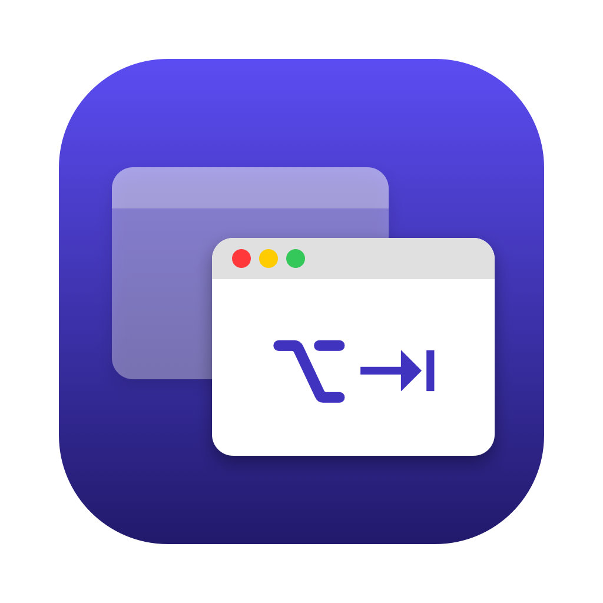
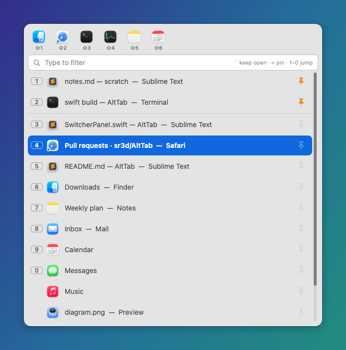
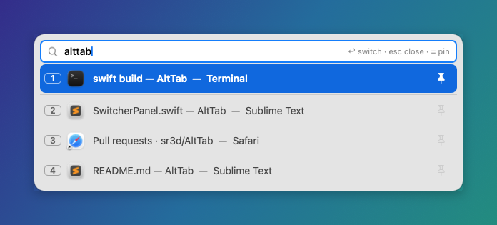
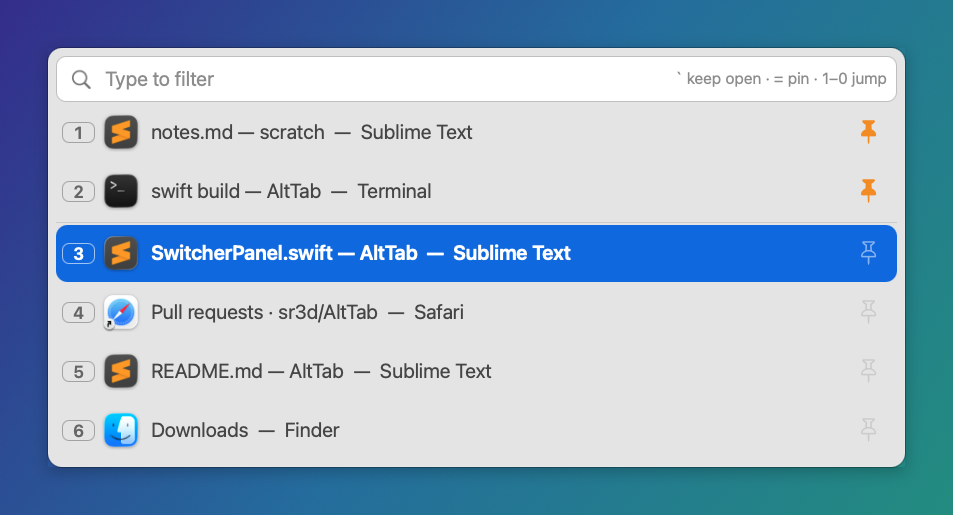
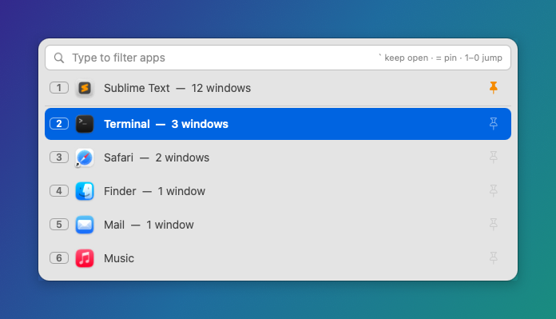
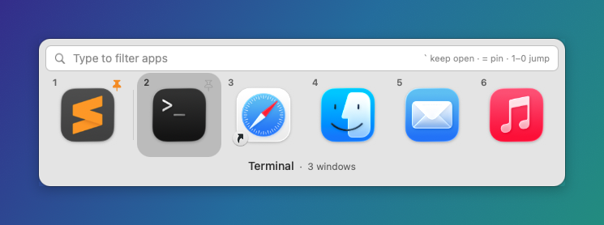
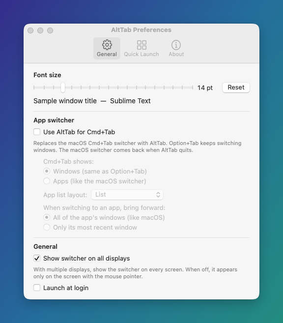
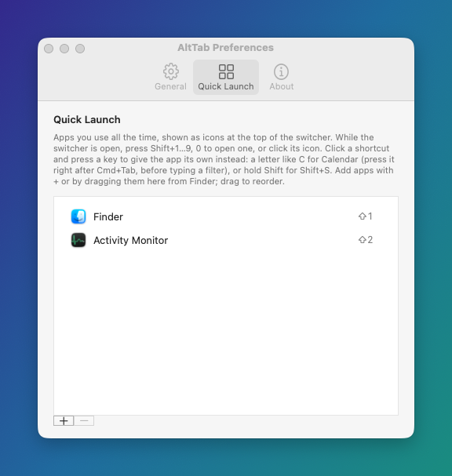
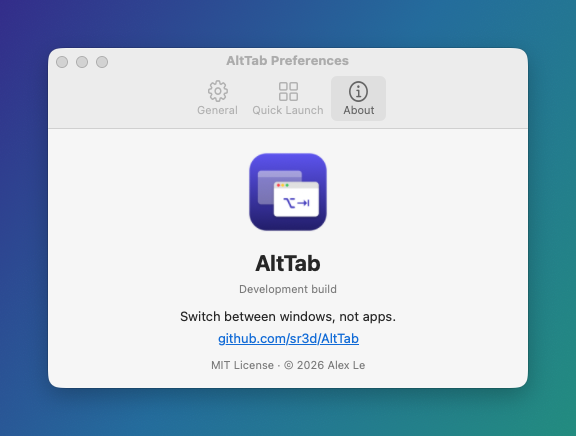

<p align="center">
  
</p>

<h1 align="center">AltTab</h1>

<p align="center">
  A tiny macOS menu-bar app that switches between <b>windows</b>, not apps.<br>
  <a href="https://github.com/sr3d/AltTab/actions/workflows/build.yml"></a>
</p>

Cmd+Tab activates a whole app, so every window of that app jumps forward and buries what you were looking at. **Option+Tab** brings back just the one window you were in before. Hold Option to pick any window from a list that you can pin, number and filter.

<p align="center"></p>

## Features
- **Previous window in one tap:** Option+Tab jumps to the last window you used. Only that window comes forward, so multi-window apps like Sublime Text, Chrome or Terminal don't flood the screen.
- **Focus history:** the list is ordered by the windows you actually used most recently, not by stacking order. It stays correct after a Cmd+Tab brings a whole app forward.
- **Pins:** keep favourite windows at the top. Drag to reorder them.
- **Number keys:** press 1–9 or 0 to jump straight to a row. Pinned windows get the first numbers.
- **Quick Launch:** keep the apps you use all the time (Finder, Slack, Activity Monitor…) as icons at the top of the switcher, and open one with Shift+1–9, 0.
- **Quick filter:** start typing to narrow the list by window title or app name.
- **Keyboard or mouse:** arrow keys, Tab/Shift+Tab, hover, the scroll wheel and clicks all work. Long lists get a scrollbar you can drag.
- **Adjustable size:** set the font size in Preferences; the whole panel scales with it.
- **Multiple displays:** the switcher appears on every screen by default, or only on the one with the mouse pointer if you turn that off in Preferences.
- **Optional Cmd+Tab takeover:** replace the macOS app switcher with AltTab. Cmd+Tab can open the window list (default) or an app list that has the same pins, numbers, filter and mouse support.

| Filter | Larger font | Cmd+Tab app list |
|---|---|---|
|  |  |  |

<p align="center"></p>

## Install
1. Download `AltTab-x.y.z.dmg` from [Releases](https://github.com/sr3d/AltTab/releases), open it, and drag `AltTab.app` onto the `Applications` shortcut. A `.zip` of the app is there too.
2. The release builds are not notarized, so macOS blocks the first launch. Open **System Settings → Privacy & Security** and click **Open Anyway**, or run:
   ```sh
   xattr -dr com.apple.quarantine /Applications/AltTab.app
   ```
3. Launch it and grant **Accessibility** when asked (System Settings → Privacy & Security → Accessibility). The menu-bar label reads `AltTab ⚠︎` until the permission is active, then just `AltTab`.

Turn on **Launch at Login** from the menu-bar menu or Preferences.

## Usage
| Keys | Action |
|---|---|
| **Option+Tab** (tap) | switch to the previous window |
| **Option** held + **Tab** | open the list; release Option to switch |
| **Cmd+Tab** (if enabled in Preferences) | the same, listing windows (default) or running apps, as chosen in Preferences |

While the list is open:

| Keys / mouse | Action |
|---|---|
| Tab / → / ↓ · Shift+Tab / ← / ↑ | move the selection |
| 1–9, 0 | jump straight to that row |
| Shift+1–9, 0 or click an icon in the top bar | open that Quick Launch app |
| `=` or click 📌 | pin / unpin the window |
| drag a pinned row | reorder pins |
| `` ` `` or click the filter bar | keep the list open after releasing Option |
| type letters | filter (every word must match the title or app name); Backspace edits |
| hover / scroll wheel | select the row under the mouse / step through rows |
| Return or click a row | switch to that window |
| Esc | clear the filter, or close the list if the filter is empty |
| click outside (when kept open) | close |

Any mouse use in the list also keeps it open, so letting go of Option doesn't switch mid-click.

Scope and limits:
- The list covers visible windows on the current Space. Minimized windows, hidden apps and other Spaces aren't listed.
- Pins last until AltTab quits.
- Focus history starts when AltTab launches; before that, the list uses stacking order.

### Preferences
Menu bar → **AltTab → Preferences…** (⌘,) or **About AltTab**

| General | Quick Launch | About |
|---|---|---|
|  |  |  |

- **Font size:** 11–28 pt (default 14). Rows, icons, the filter bar and the panel width all scale with it.
- **Use AltTab for Cmd+Tab:** Cmd+Tab (and Cmd+Shift+Tab) open AltTab. Choose what it shows: **Windows** (default, the same list as Option+Tab) or **Apps** (running apps, ordered by most recent use). For Apps, pick the layout: a **List** (default) or **Icons**, a horizontal strip of app icons like the macOS switcher. Also choose whether switching to an app brings **all of its windows** forward (like macOS) or **only its most recent window**. To hear Cmd+Tab, AltTab turns off the macOS switcher while it runs. It turns it back on when AltTab quits, is killed, or crashes, and again on the next launch.
- **Show switcher on all displays:** on (default) shows the panel on every connected screen, and you can use any of them. Off shows it only on the screen with the mouse pointer.
- **Launch at login.**
- **Quick Launch tab:** the apps in the bar at the top of the switcher (Finder and Activity Monitor to start with). Add with **+** or by dragging apps in from Finder, remove with **−** or Delete, drag to reorder. The first ten get Shift+1–9, 0.

## Build from source
Requires macOS 13+ and Swift 5.9+. The Command Line Tools are enough; Xcode is only needed for universal (arm64 + x86_64) builds.

```sh
./scripts/build-app.sh --open      # build, sign, install to ~/Applications, launch
./scripts/build-app.sh --no-install
ALTTAB_UNIVERSAL=1 ./scripts/build-app.sh --no-install   # needs Xcode
./scripts/make-dmg.sh              # build, then package build/AltTab-<version>.dmg and .zip
```

**Signing:** macOS ties the Accessibility grant to the code signature. The script signs with an identity named `AltTab Dev` if one exists, otherwise with your first `Apple Development` certificate. Either one stays the same across rebuilds, so the grant sticks. If neither exists, the script falls back to an ad-hoc signature, and you'd have to re-grant Accessibility after every build. To create a stable identity for free: Keychain Access → Certificate Assistant → Create a Certificate… (Name `AltTab Dev`, Type *Code Signing*). If the grant gets stuck, run `tccutil reset Accessibility com.sr3d.AltTab` and relaunch.

**CI:** both workflows run `scripts/make-dmg.sh` to build a universal, ad-hoc-signed app and package it as a DMG and a zip. [`build.yml`](.github/workflows/build.yml) runs on every push to `main` and every pull request, and uploads them as a workflow artifact. [`release.yml`](.github/workflows/release.yml) runs when a `v*` tag is pushed, and publishes a GitHub Release with both files attached. GitHub builds everything on its own macOS machines, so a release is just a tag:
```sh
git tag v0.1.0 && git push origin v0.1.0
```
To rebuild the files for an existing tag, run **Release** by hand from the Actions tab and enter the tag.

**Developer tools:**
- `swift run FocusSpike` lists on-screen windows; `swift run FocusSpike <title>` focuses one.
- `.build/debug/AltTab --screenshots docs` regenerates the README screenshots. It renders the real panel with made-up window titles.
- `swift scripts/make-icon.swift` regenerates the app icon.
- Debug logging:
  ```sh
  defaults write com.sr3d.AltTab debug -bool true   # then relaunch
  log stream --predicate 'subsystem == "com.sr3d.AltTab"'
  ```

## How it works
| File | Role |
|---|---|
| `Sources/AltTab/HotkeyTap.swift` | `CGEventTap` for Option+Tab (and Cmd+Tab when enabled) and the keys used while the list is open. Keys are swallowed so they never reach the app underneath. |
| `Sources/AltTab/NativeCommandTab.swift` | Turns the macOS Cmd+Tab switcher off or on (`CGSSetSymbolicHotKeyEnabled`), and restores it on quit, on kill signals and after crashes. |
| `Sources/AltTab/WindowTracker.swift` | Builds the focus history from an `AXObserver` per app plus workspace activation events. It also keeps a background cache of each app's windows: some apps take seconds to answer Accessibility queries, so a keypress never waits on them. |
| `Sources/AltTab/Switcher.swift` | List state: ordering, pins, filter, number keys, stay-open mode |
| `Sources/AltTab/QuickLaunch.swift`, `QuickLaunchEditor.swift` | Quick Launch apps (stored by path and bundle ID) and their Preferences list |
| `Sources/AltTab/SwitcherPanel.swift` | The non-activating HUD panel and its mouse handling |
| `Sources/AltTabCore/WindowList.swift` | On-screen windows (`CGWindowListCopyWindowInfo`), matched to Accessibility windows via `_AXUIElementGetWindow` |
| `Sources/AltTabCore/WindowFocuser.swift` | Brings exactly one window forward: `_SLPSSetFrontProcessWithOptions` + a synthetic make-key event + an AX raise |
| `Sources/AltTabCore/PrivateAPIs.swift` | Private SkyLight calls, loaded with `dlopen`. If a symbol is missing, focusing falls back to public APIs. |

Raising one window without bringing its whole app forward isn't possible with public APIs alone. The technique comes from [yabai](https://github.com/koekeishiya/yabai) and [Hammerspoon](https://github.com/Hammerspoon/hammerspoon/issues/370#issuecomment-545545468), as refined by [alt-tab-macos](https://github.com/lwouis/alt-tab-macos). This project is a separate, much smaller app and isn't affiliated with alt-tab-macos.

### Why there's no "always on top" pin
macOS doesn't let one app change the window level of another app's window. yabai can do it by injecting code into the Dock, but that requires partially disabling System Integrity Protection. The only SIP-safe workaround is a live ScreenCaptureKit mirror in a floating panel, which is view-only and needs Screen Recording permission.

## License
[MIT](LICENSE)
